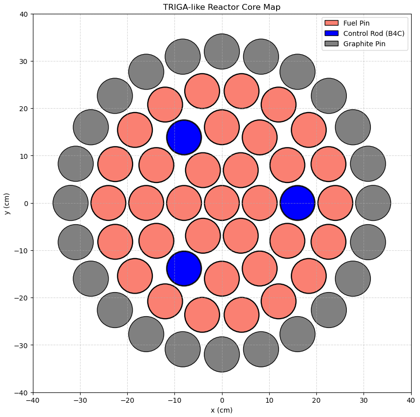

# NSE-Python-Numerical-Methods-Course-Work

      *Figure 1: Generated TRIGA-like reactor core geometry showing fuel pins, control rods, and graphite reflectors.*

This repository contains a collection of numerical methods and reactor physics simulations developed using Python. The projects focus on implementing core mathematical algorithms from scratch to solve neutron transport, shielding, criticality, decay, and reactor geometry problems.

## Specifications
* **Language:** Python
* **Libraries:** NumPy, Matplotlib, SciPy
* **Concepts:** Point Reactor Kinetics, Neutron Transport, Monte Carlo Simulation, Neutron Shielding.

## Project Modules

### 1. Basic Numerical Methods (`HW1`)
* **Contents:** Basic input/output, error handling, and introductory physics calculations.
* **Methods:** Harriot’s method for solving general cubics, iterative loops.
* **Physics:** Nuclear Q-values and relativistic mass.

### 2. Statistics and Inhour Equation (`HW2`)
* **Contents:** Matrices, arrays, statistics, and the Inhour equation for reactor point kinetics.
* **Methods:** Gaussian distribution analysis, mean & std, Monte Carlo integration.
* **Physics:** Reactor Kinetics (visualizing the Inhour equation roots).

### 3. Reactor Core Visualization & Decay Kinetics (`HW3`)
* **Contents:** Advanced plotting with matplotlib, subplots, and 2D fields.
* **Methods:** 2D trajectory simulation, scalar field heatmaps, logarithmic plotting.
* **Physics:** Projectile motion and Radioactive Decay Chains (Bateman Equations).

### 4. Numerical Integration & ODE Solvers (`HW4`)
* **Contents:** Coding integration algorithms from scratch and using SciPy for differential equations.
* **Methods:** Trapezoidal rule, Simpson's 1/3 rule implementation, error convergence analysis, Runge-Kutta.
* **Physics:** Reactor Point Kinetics (response to step reactivity insertion).

### 5. Neutron Transport & Shielding (`HW5`)
* **Contents:** Stochastic simulation of particle transport, energy distribution visualization, and root-finding.
* **Methods:** Analog Monte Carlo simulation (random walks, sampling exponential distributions), parameter sweeps, Matplotlib histograms, Newton-Raphson/Secant methods.
* **Physics:** Neutron transmission vs. absorption, scattering ratios, and quantum potential wells.

### 6. Linear Algebra and Finite Difference Methods (`HW6`)
* **Contents:** Solving systems of linear equations and discretizing differential equations.
* **Methods:** Finite Difference Method (FDM), diagonal dominance checks, sparse matrix construction.
* **Physics:** 1D Neutron Diffusion (flux profiles) and 2D Steady-State Heat Transfer.
